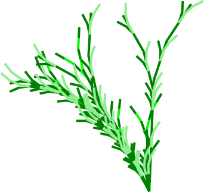

# Supercollider L-systems
This is a set of supercollider compositions to musicially illustrate some l-systems I wrote.

In the long term this effort is to arrive at something like L-Systems performing Ragas in supercollider :)

Last year I worked a bit on @avanka 's lsystems drawing tool. That was fun. I wanted color and was obliged. I made some plant life.

https://anvaka.github.io/lsystem/

Now, I rediscovered an L-System composition thingy from http://sccode.org/1-5bp it's fun. 

This repo contains:
* Systems for avankas views
* scd files realizing a musical composition of said system
* an image of the view
* a recording of the super collider program

In the main, the supercollider files designated as Pbindef are more musical and or interesting.

Here is an example:

# poetasters succulent 1

The simplified form of axiom and rules (without color):

```
axiom: A
rules:
 A =>[FL]A[FLA]
 F => SF 
 S => FL
 L => [F+F+F]f[F-F-F]

```

https://github.com/poetaster/supercollider-lsystems/blob/main/succulent.mp3





# supercollider audio rendering

The 'Panola renderings are boring, but have properties I'll explore later.


## link to render  in anvaka's WebGL renderer

https://anvaka.github.io/lsystem/?code=%2F%2F%20poetasters%20succulent%201%0Aaxiom%3A%20A%0Arules%3A%0A%20A%20%3D%3E%5BFL%5DgAhg%5BFLA%5D%0A%20F%20%3D%3E%20cSF%20%0A%20S%20%3D%3E%20dFL%0A%20L%20%3D%3E%20c%5BF%2BF%2BF%5Dfe%5BF-F-F%5D%0A%0Acolor%3Agreen%0Adirection%3A%20%5B0%2C%201%2C%200.5%5D%0Awidth%3A%204%0Aangle%3A%2017%0Adepth%3A%205%0Aactions%3A%0A%20%20c%20%3D%3E%20setColor%28%27green%27%29%0A%20%20d%20%3D%3E%20setColor%28%27lime%27%29%0A%20%20e%20%3D%3E%20setColor%28%27lightgreen%27%29%0A%20%20g%20%3D%3E%20rotate%284.5%29%0A%20%20h%20%3D%3E%20rotate%28-3%29


