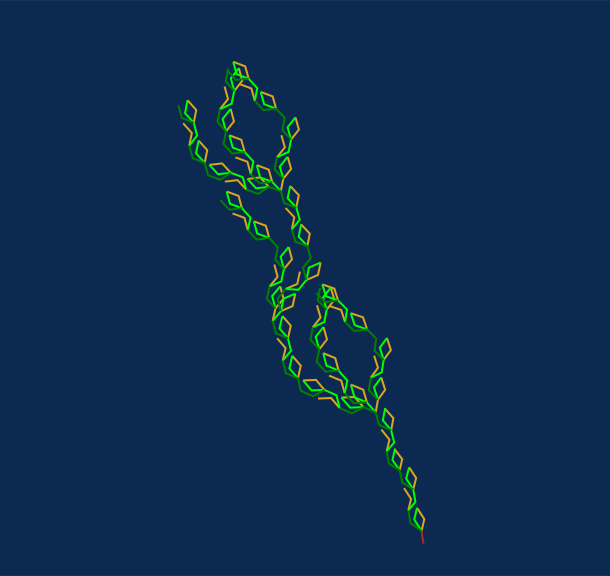

# Another Aquatic, poetaster 

The simplified form of axiom and rules (without color):

```
axiom: F
rules:
  F => FMNOMBxPNMyO
  M => e[-F++F++]
  N => d[+F--F--]
  O => c++F--F
  P => d--F++F
```



## link to render 

https://anvaka.github.io/lsystem/?code=%2F%2F%20another%20aquatic%20%0Aaxiom%3A%20F%0Arules%3A%0A%20%20F%20%3D%3E%20FMNOMBxPNMyO%0A%20%20M%20%3D%3E%20e%5B-F%2B%2BF%2B%2B%5D%0A%20%20N%20%3D%3E%20d%5B%2BF--F--%5D%0A%20%20O%20%3D%3E%20c%2B%2BF--F%0A%20%20P%20%3D%3E%20d--F%2B%2BF%0A%0Acolor%3A%20brown%0Adirection%3A%20%5B0%2C%201%2C%20-1%5D%0Aangle%3A%2027%0Adepth%3A4%0Aactions%3A%0A%20%20c%20%3D%3E%20setColor%28%27green%27%29%0A%20%20d%20%3D%3E%20setColor%28%27lime%27%29%0A%20%20e%20%3D%3E%20setColor%28%27goldenrod%27%29%0A%20%20x%20%3D%3E%20rotateX%282%29%0A%20%20y%20%3D%3E%20rotateY%28-3%29
