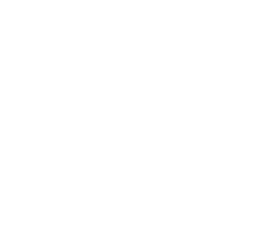

# Hexagonal Gosper

The simplified form of axiom and rules (without color):

```
axiom: X
rules:
 X => X+YF++YF-FX--FXFX-YF+
 Y => -FX+YFYF++YF+FX--FX-Y 

```



# supercollider audio rendering


## link to render 
https://anvaka.github.io/lsystem/?code=%2F%2F%20Hexagonal%20Gosper%0Aaxiom%3A%20X%0Arules%3A%0A%20X%20%3D%3E%20X%2BYF%2B%2BYF-FX--FXFX-YF%2B%0A%20Y%20%3D%3E%20-FX%2BYFYF%2B%2BYF%2BFX--FX-Y%20%0A%0Aangle%3A%2060%0Adepth%3A%203
