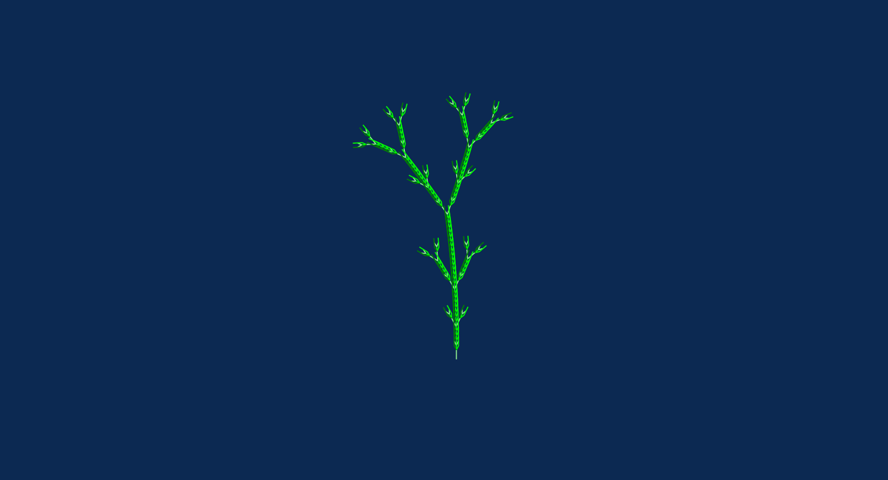

# Grains after P. Bourke 

The simplified form of axiom and rules (without color):

```
axiom: Y
rules: 
  X => X[-F+FF][+F-FF]FX
  Y => YFX[+Y][-Y]
```



# supercollider audio rendering


## link to render 

https://anvaka.github.io/lsystem/?code=%2F%2F%20Grains%2C%20after%20P.%20Bourke%0Aaxiom%3A%20Y%0Arules%3A%20%0A%20%20X%20%3D%3E%20dX%5B-F%2BFF%5Dcg%5B%2BF-FF%5DdFX%0A%20%20Y%20%3D%3E%20eYFX%5B%2BY%5D%5B-Y%5D%0A%0Adepth%3A5%0Adirection%3A%20%5B0%2C%201%2C%200%5D%0Aangle%3A%2027%0Aactions%3A%0A%20%20c%20%3D%3E%20setColor%28%27green%27%29%0A%20%20d%20%3D%3E%20setColor%28%27lime%27%29%0A%20%20e%20%3D%3E%20setColor%28%27lightgreen%27%29%0A%20%20g%20%3D%3E%20rotate%280.3%29
