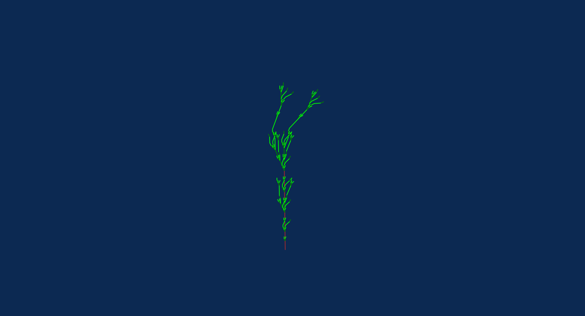

# weed, after P. Bourke 

The simplified form of axiom and rules (without color):

```
axiom: F
rules:
  F -> FF-[XY]+[XY]
  X -> +FY
  Y -> -FX
```



## link to render 

https://anvaka.github.io/lsystem/?code=%2F%2F%20weed%2C%20after%2C%20P.%20Bourke%0Aaxiom%3A%20F%0Arules%3A%0A%20%20F%20-%3E%20FF-%5BXY%5D%2B%5BXY%5D%0A%20%20X%20-%3E%20%2BcFY%0A%20%20Y%20-%3E%20-dFX%0A%0Acolor%3A%20brown%0Adirection%3A%20%5B0%2C%201%2C%200.5%5D%0Aangle%3A%2022.5%0Adepth%3A5%0Aactions%3A%0A%20%20c%20%3D%3E%20setColor%28%27green%27%29%0A%20%20d%20%3D%3E%20setColor%28%27lime%27%29
